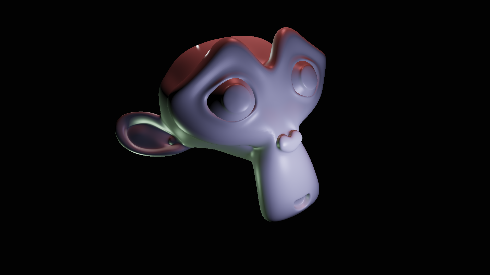
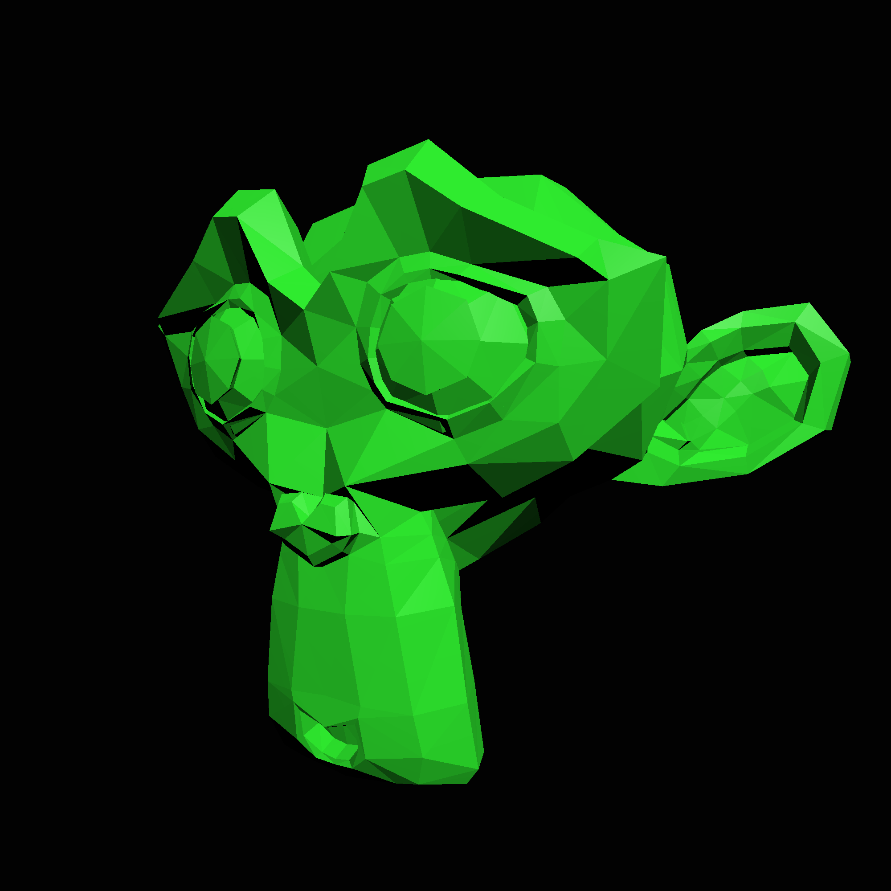

Softrender
==========

WIP Software Renderer in Rust

[Documentation](https://docs.rs/softrender/)

### Example:

#### Complex, full example ~450 LOC

See the [Full Example](/full_example/) for more info on the above.

#### Simple, single file example ~200 LOC

### Current Features:

* Rendering pipeline with user-defined vertex and fragment shaders.
* User-defined shader uniforms, both global and intermediate uniforms.
* Point, Line, Wireframe and Triangle shading models.
    * All can be shaded using the next bullet point.
* Full Barycentric interpolation of intermediate uniforms for triangle rasterization.
    * This means nice smooth shading on a per-fragment basis is easy and fast.
* Flexible framebuffer with color and depth components.
    * Includes a `f32` RGBA color component for default use, 
      and nalgebra's `Vector4<f32>` can also be used as a color component.
* Parallel rendering with Rayon.
    * Vertex processing and Fragment shading are all done in parallel, with as little overhead as possible.
* Simple yet flexible Mesh representation.
    * Define your own vertex attributes.
* Built-in compatibility with the `image` crate, using the `image_compat` cargo feature. 

### Planned Features:

* Stencil buffer
* Generic texture support
* Multi-target framebuffers
    * Such as multiple color components, which is useful for deferred rendering.
* Framebuffer to texture conversion, to compliment the above points.
    
### Glaring Problems

#### Clipping, all of it. 

Geometry at the edge of the screen is totally messed up, and I don't know how to fix it as of writing this. 
Any help would be greatly appreciated. I really want to fix it but have no idea how yet.
    
#### Multi-mesh performance.

Although this can chew through millions of triangles per second easy in a single mesh,
split that into ten meshes a tenth the size and suddenly it's quite a few times slower.

This is mostly because while rendering meshes, each thread is given a partial empty framebuffer 
(depth buffer is copied to allow early depth fails), which are all then merged together into the real framebuffer. 
A single large mesh will allocate less memory overall than many small meshes.

A potential solution to this would be to write an alternative pipeline meant for batch processing meshes,
so memory allocation is done once per all meshes, but some more work needs to be done until I can plan that out in more detail.